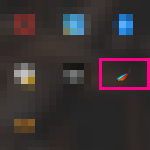

# OpeWinについて 

OpeWinはデスクトップ上の他のアプリのウィンドウ位置やサイズをホットキーでコントロールできるWindowsアプリケーションです。<br/>
本アプリでは，ホットキーの登録と各ホットキーに割り当てる他のアプリのウィンドウに対する操作(本アプリではOpeと呼びます)の設定ができます。<br/>
ホットキーに割り当てるOpeはOpeScriptと呼ぶluaライクな言語で記述します。
<br/>
<br/>

# 設定画面
本アプリはタスクトレイ常駐型です。タスクトレイの以下のアイコンをダブルクリックすると設定画面が開きます:<br/>

<br/>
<br/>

# OpeScriptについて
本節ではOpeScriptの言語仕様について説明します。<br/>
<br/>
<br/>

## 変数
|変数 |説明 |
|---|---|
|Count |ホットキーが連続で入力された回数が格納されます。<br/>初回入力時には0がセットされ，2回以降連続で同じホットキーが入力されるとインクリメントします。|
<br/>
<br/>

## 関数
|関数 |説明 |
|---|---|
|Maximize()                              |アクティブなウィンドウを最大化します。 |
|Minimize()                              |アクティブなウィンドウを最小化します。 |
|Restore()                               |アクティブなウィンドウを最大化/最小化前のウィンドウサイズに戻します。 |
|MoveTo(double rate_x, double rate_y)    |アクティブなウィンドウを引数で指定したスクリーン相対位置に移動させます。|
|ResizeTo(double rate_x, double rate_y)  |アクティブなウィンドウを引数で指定したスクリーン相対サイズに移動させます。|
|MoveBy(double rate_x, double rate_y)    |アクティブなウィンドウを引数で指定したスクリーン相対サイズ分移動させます。|
|ResizeBy(double rate_x, double rate_y)  |アクティブなウィンドウを引数で指定したスクリーン相対サイズ分増減させます。|
|ChangeMonitorFw()                       |アクティブなウィンドウを次のモニタの同じスクリーン相対位置に移動させます。|
|ChangeMonitorBw()                       |アクティブなウィンドウを前のモニタの同じスクリーン相対位置に移動させます。|
|ResetCount()                            |変数Countを0に戻します。|

## OpeScript記述例

```

if Count == 0 then
	MoveTo(0, 0)
	ResizeTo(1/2, 1)
elseif Count == 1 then
	MoveTo(0, 0)
	ResizeTo(1/3, 1)
elseif Count == 2 then
	MoveTo(0, 0)
	ResizeTo(2/3, 1)
	ResetCount()
end

```
