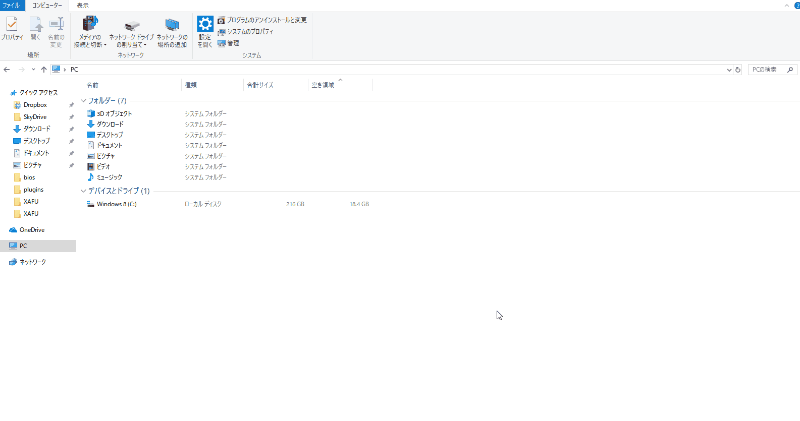

# OpeWinについて 

OpeWinはデスクトップ上の他のアプリのウィンドウ位置やサイズをホットキーで自由にコントロールできるWindowsアプリケーションです。<br/>
本アプリでは，ホットキーの登録と各ホットキーに割り当てる他のアプリのウィンドウに対する操作(本アプリではOpeと呼びます)の設定ができます。<br/>
ホットキーに割り当てるOpeはOpeScriptと呼ぶluaライクな言語で記述します。


<br/>
<br/>

# 設定
- タスクトレイアイコンをダブルクリックすると設定画面が開きます。
新しいOpeは"+"ボタンで追加します。
- "Name"列で追加したOpeに動作がわかるような任意の名前をつけてください。
- "Hotkey"列のセルにカーソルを当てた状態で登録したいキー組合せを押下してください。
- "Script"列の"Edit"ボタンを押下して出てくるScript設定ウィンドウでOpeの動作をプログラミングしてください。詳細は「OpeScriptについて」の章を参照してください。
- 一通りの設定が完了したら"OK"ボタンを押してください。設定画面が閉じられた時点からホットキーが有効化します。
<br/>


<br/>
<br/>

# OpeScriptについて
本節ではOpeScriptの言語仕様について説明します。<br/>
<br/>
<br/>

## 用語定義

|用語|説明|
|---|---|
|アクティブなウィンドウ|現在ユーザの入力を受け付けているアプリのウィンドウを指します。|
|スクリーン            |アクティブなウィンドウの表示領域が最も広いモニタのスクリーンを指します。|
|仮想スクリーン        |複数のモニタのスクリーンを包含する最小の短形領域を指します。|
|スクリーン比          |スクリーンの縦横を「1」としたときの縦方向および横方向の長さの比を示します。
|スクリーン相対位置    |スクリーンにおける位置を原点からのスクリーン比で表現した座標(rate_x(0～1), rate_y(0～1))を示します。<br/> 原点は各スクリーンの左上です。|
|仮想スクリーン比          |仮想スクリーンの縦横を「1」としたときの縦方向および横方向の長さの比を示します。
|仮想スクリーン相対位置    |仮想スクリーンにおける位置を原点からの仮想スクリーン比で表現した座標(rate_x(0～1), rate_y(0～1))を示します。<br/> 原点は左上です。|

<br/>
<br/>

## 変数
|変数 |説明 |
|---|---|
|Count |ホットキーが連続で入力された回数が格納されます。<br/>初回入力時には0がセットされ，2回以降連続で同じホットキーが入力されるとインクリメントします。|
<br/>
<br/>

## 関数
|関数 |説明 |
|---|---|
|Maximize()                              |アクティブなウィンドウを最大化します。 |
|Minimize()                              |アクティブなウィンドウを最小化します。 |
|Restore()                               |アクティブなウィンドウを最大化/最小化前のウィンドウサイズに戻します。 |
|MoveTo(double rate_x, double rate_y)    |アクティブなウィンドウを引数で指定したスクリーン相対位置に移動させます。|
|ResizeTo(double rate_x, double rate_y)  |アクティブなウィンドウのサイズを引数で指定したスクリーン比に変更します。|
|VSMoveTo(double rate_x, double rate_y)  |アクティブなウィンドウを引数で指定した仮想スクリーン相対位置に移動させます。|
|VSResizeTo(double rate_x, double rate_y)|アクティブなウィンドウのサイズを引数で指定した仮想スクリーン比に変更します。|
|MoveBy(double rate_x, double rate_y)    |アクティブなウィンドウを引数で指定したスクリーン比分移動させます。<br/>(+で右/下，-で左/上方向へ移動します。)|
|ResizeBy(double rate_x, double rate_y)  |アクティブなウィンドウを引数で指定したスクリーン比増減させます。<br/>(+で増加，-で減少します)|
|ChangeMonitorFw()                       |アクティブなウィンドウを次のモニタの同じスクリーン相対位置に移動させます。|
|ChangeMonitorBw()                       |アクティブなウィンドウを前のモニタの同じスクリーン相対位置に移動させます。|
|ResetCount()                            |変数Countを0に戻します。|

<br/>
<br/>

## OpeScript記述例

以下のOpeScriptはif制御文を使用して，ホットキーの連続入力時，周期的に異なるOpeが実行されるようにした例です。

### 左寄せ

```

# ホットキーを連続して入力すると
# 以下のパターンが繰り返し実行されます
if Count == 0 then
	# 1パターン目
	# ウィンドウを画面の左半分に表示
	MoveTo(0, 0)
	ResizeTo(1/2, 1)
elseif Count == 1 then
	# 2パターン目
	# ウィンドウを画面の左1/3に表示
	MoveTo(0, 0)
	ResizeTo(1/3, 1)
elseif Count == 2 then
	# 3パターン目
	# ウィンドウを画面の左2/3に表示
	MoveTo(0, 0)
	ResizeTo(2/3, 1)
    # パターンを繰り返すようにカウントをリセット
	ResetCount()
end

```
